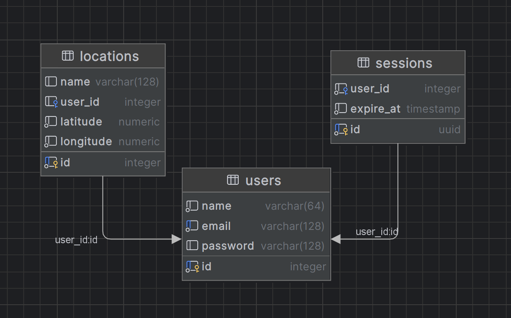
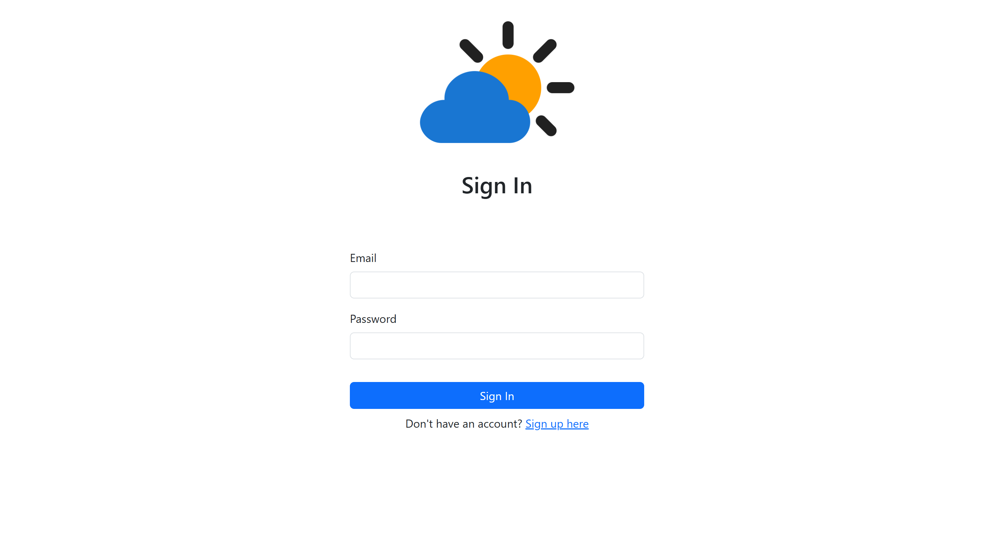
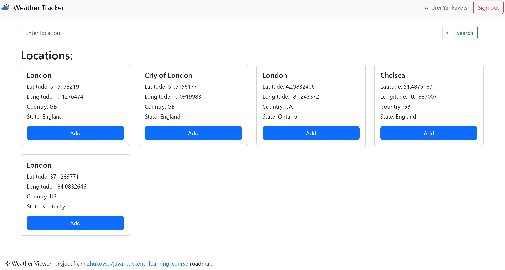
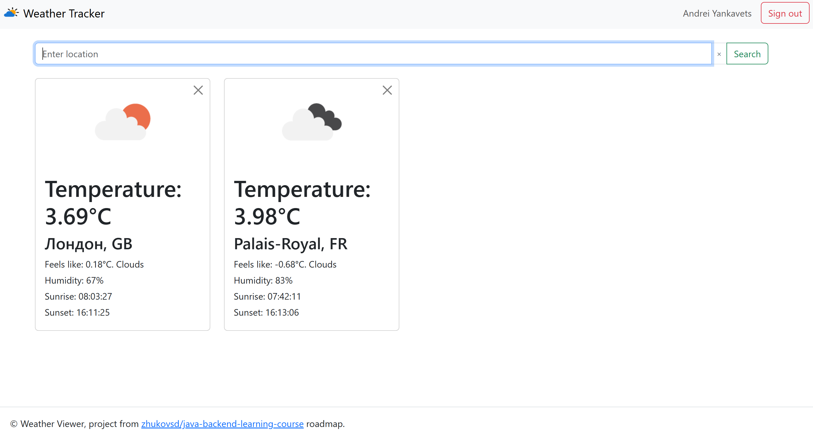

<h1 align="center">WeatherTracker</h1>

### 📝 Main Technologies

|  **Database**  |                                                     [](https://www.postgresql.org/)                                                      |
|:--------------:|:--------------------------------------------------------------------------------------------------------------------------------------------------------------------------------------------------------------------------------------------------------------:|
|  **Backend**   | [](https://dev.java/) [](https://spring.io/) |
|  **Frontend**  |                                                                     [](https://www.thymeleaf.org)                                                                     |
| **Build Tool** |                                                             [](https://maven.apache.org)                                                              |
|    **PaaS**    |                                                            [](https://www.docker.com/)                                                             |

---

## ⚙️ Getting Started

### 🐋 Start with Docker

* Clone the repository

```console
https://github.com/Encerel/WeatherTracker
```

* Use docker-compose

```console
docker-compose build
```

```console
docker-compose up
```

## Application Features

### 1.1 User related

> Classic authorization

- Sign in
- Sign up
- Sign out

### 1.2 Locations related

> Classic CRUD

- **Search** a location to track the weather
- **Add** a location to the tracked list
- **View** a list of locations with weather for each location
- **Delete** a location from the tracked list

### 2.2 Data Model

The application have three main entities - User, Session and Location.



## 🪄 Demo








